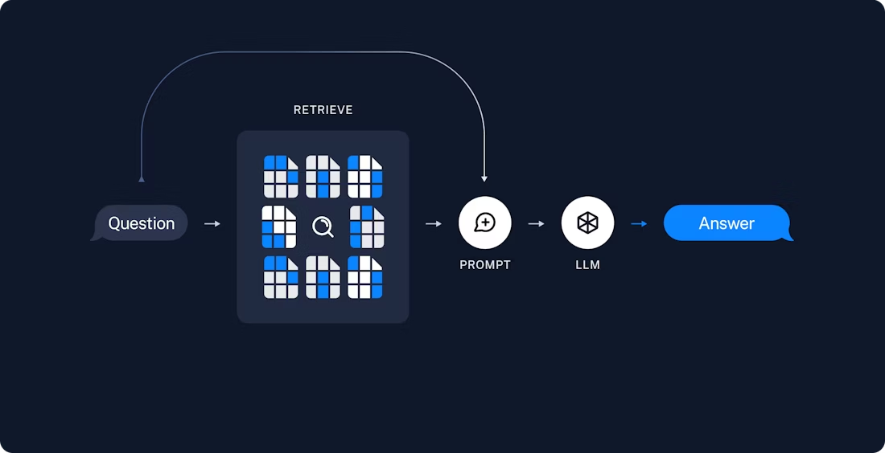

# RAG System with LangChain and Pinecone

## Descripción Técnica

Este proyecto implementa un sistema de **Retrieval-Augmented Generation (RAG)** utilizando LangChain, Pinecone Vector Database y OpenAI GPT-4. El sistema permite realizar consultas inteligentes sobre documentos web indexados en una base de datos vectorial.

## Arquitectura del Sistema

### Componentes Principales

1. **Document Loader**: Carga y parsea contenido web usando BeautifulSoup4
2. **Text Splitter**: Divide documentos en chunks con overlap para mejor contexto
3. **Embeddings**: Genera vectores usando OpenAI text-embedding-3-large (1024 dimensiones)
4. **Vector Store**: Almacena y busca vectores en Pinecone
5. **Agent**: Orquesta la recuperación de información y generación de respuestas con GPT-4

### Flujo de Datos



## Stack Tecnológico

- **Python 3.x**
- **LangChain**: Framework para aplicaciones con LLMs
- **OpenAI API**: 
  - GPT-4.1 para generación de respuestas
  - text-embedding-3-large para vectorización
- **Pinecone**: Base de datos vectorial para búsqueda semántica
- **BeautifulSoup4**: Parsing de contenido HTML
- **python-dotenv**: Gestión de variables de entorno

## Instalación

### 1. Clonar el Repositorio

```bash
git clone <repository-url>
cd tarea8
```

### 2. Crear Entorno Virtual (Recomendado)

```bash
python -m venv venv
source venv/bin/activate  # En Windows: venv\Scripts\activate
```

### 3. Instalar Dependencias

Ejecutar las celdas de instalación en el notebook `tarea8.ipynb` o instalar manualmente:

```bash
pip install openai python-dotenv
pip install langchain langchain-text-splitters langchain-community bs4
pip install -U "langchain[openai]"
pip install -U "langchain-openai"
pip install -qU langchain-pinecone
```

## Configuración

### Variables de Entorno

Crear un archivo `.env` en la raíz del proyecto con las siguientes claves:

```env
OPENAI_API_KEY=sk-your-openai-api-key
PINECONE_API_KEY=your-pinecone-api-key
PINECONE_INDEX_NAME=your-index-name
LANGCHAIN_API_KEY=your-langchain-api-key
LANGCHAIN_TRACING=true
```

### Configuración de Pinecone

1. Crear cuenta en [Pinecone](https://www.pinecone.io/)
2. Crear un nuevo índice con las siguientes especificaciones:
   - **Dimensiones**: 1024 (para text-embedding-3-large)
   - **Métrica**: cosine similarity
   - **Región**: Seleccionar según preferencia

## Uso

### Ejecutar el Notebook

1. Abrir `tarea8.ipynb` en Jupyter Lab, VS Code o JupyterLab
2. Ejecutar las celdas en orden secuencial:
   - Celdas 1-5: Instalación de dependencias
   - Celdas 6-11: Importación de librerías
   - Celdas 12-21: Configuración y ejecución

### Flujo de Trabajo

1. **Carga de Documentos**: El sistema carga contenido de un blog post específico
2. **Chunking**: Divide el documento en fragmentos de 1000 caracteres con overlap de 200
3. **Indexación**: Genera embeddings y almacena en Pinecone
4. **Query**: El agente procesa consultas usando RAG
5. **Respuesta**: Devuelve información contextual basada en el documento

### Ejemplo de Query

```python
query = (
    "What is the standard method for Task Decomposition?\n\n"
    "Once you get the answer, look up common extensions of that method."
)

for event in agent.stream(
    {"messages": [{"role": "user", "content": query}]},
    stream_mode="values",
):
    event["messages"][-1].pretty_print()
```

## Características Principales

### Text Splitting
- **Chunk Size**: 1000 caracteres
- **Chunk Overlap**: 200 caracteres
- **Strategy**: RecursiveCharacterTextSplitter para mantener coherencia semántica

### Embeddings
- **Model**: text-embedding-3-large
- **Dimensions**: 1024
- **Provider**: OpenAI

### Vector Store
- **Database**: Pinecone
- **Similarity Metric**: Cosine similarity
- **Top K Results**: 2 documentos más relevantes

### Agent Capabilities
- **Tool**: retrieve_context con formato content_and_artifact
- **Model**: GPT-4.1
- **Streaming**: Respuestas en tiempo real

## Estructura del Proyecto

```
tarea8/
├── tarea8.ipynb          # Notebook principal con implementación RAG
├── .env                  # Variables de entorno (no versionado)
├── .gitignore           # Archivos excluidos de git
└── README.md            # Documentación del proyecto
```

## Consideraciones de Seguridad

- **API Keys**: Nunca commitear el archivo `.env` con claves reales
- **Rate Limits**: Considerar límites de OpenAI y Pinecone APIs
- **Costos**: Monitorear uso de embeddings y tokens GPT-4

## Recursos Adicionales

- [LangChain Documentation](https://python.langchain.com/)
- [Pinecone Documentation](https://docs.pinecone.io/)
- [OpenAI API Reference](https://platform.openai.com/docs/)

## Autor
Juan Andrés Rodriguez Peñuela
